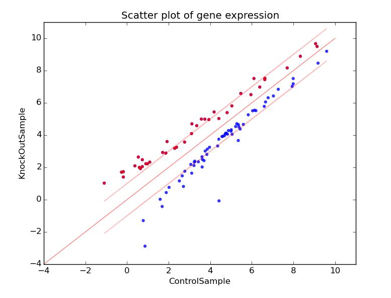

.. OMG documentation master file, created by
   sphinx-quickstart on Mon Mar 25 04:43:25 2019.
   You can adapt this file completely to your liking, but it should at least
   contain the root `toctree` directive.

OMG software requirments specification
======================================

* IBRAHIM MOHAMED IBRAHIM ISMAIL-201732120159
* Yussuf Mohamed mahdi-201732120173
* Class: SE 2017 

Contents
========
Introduction 
************
Purpose 
+++++++
Scope 
+++++
Definitions and Abbreviations 
+++++++++++++++++++++++++++++
References 
++++++++++
Overview 
++++++++
The Overall Description 
***********************
Product Perspective 
+++++++++++++++++++
System Interfaces 
-----------------
User Characteristics 
++++++++++++++++++++
Constraints 
+++++++++++
Assumptions and Dependencies 
++++++++++++++++++++++++++++
Specific Requirements 
*********************
Functional Requirements 
+++++++++++++++++++++++
Input 
+++++
OutPut 
++++++
Table Analyzing 
---------------
Plot Analyzing 
--------------
Non-Functional Requirements 
***************************
Response Time
+++++++++++++
Aesthetic Aspects 
+++++++++++++++++
Confidentiality Policy 
++++++++++++++++++++++
Future Changes 
**************

.. toctree::
   :maxdepth: 2
   :caption: Contents:

Introduction 
============

Purpose 
*******
This document was written to specify OMG’s software  requirements specifications for the developers, designers, maintainers, and stakeholders.

Scope 
*****
Gene analyzing web application. 
The application. Simply, takes a plain text file (.txt) as an input, containing three columns, gene ID , control sample, knock out sample. Analyzes the samples, and returns a table of the analyzation result, and a scatter plot demonstrating the deferentially expressed genes.

Definitions, and Abbreviations. 
*******************************
* **Control sample** - A cell sample prepared in its normal condition.
* **Treatment sample** - A cell sample treated by special chemicals, or in which some genes are altered.
* **Deferentially expressed genes** - The genes which have significantly different expression levels between two samples.
* **Up-regulation** - A gene is said to be up-regulated if it has higher expression in treatment - than in control.
* **logFC** - log fold change of gene expression. log_2 [T/C], where T is the gene expression level from a treatment sample, while C is the gene expression level from a control sample.

References 
**********
See **Software Requirements Specification for OMG Version 0.1**
https://oh-my-genes.readthedocs.io/en/latest/

*Written by:* 
1. 宋一豪
2. 徐宇泽

Overview 
********
In this document we specify the requirements that the application must follow, what to avoid, and (if any) future changes, as well as some predictions, and critical cases.

The Overall Description 
=======================
The users can upload the data text document to the application by browsing their machine locating the directory, then hit the upload button. No registration needed and the application supports only English.

Product Perspective 
*******************
This is a complement of the OMG web application project developed by ZJNU Software Engineering class 2016.

System Interfaces 
-----------------
The application uses different APIs, such as flask, jinja, and werkzueg. Developers or maintainers dealing with this application must have a good background about those API librarys.

User Characteristics 
********************
* **Client User**: Biologists who devote themselves studying the expression of genes.
* **Site Maintainer**: Technicians who have the basic knowledge of flask and python to maintain a website.

Constraints 
***********

1. application must be compatible with the most used browsers around the world e.g firefox, chrome, and internet explorer.
2. application size must not be > **1GB**.
3. application memory usage must be **limited** under certain level so the machine runs properly.
4. application’s budget for now **10K** USD. (**TBA**) 
5. application’s System downtime < **30 minutes per year**.
6. application must know how to handle different input values,for example if the gene equation happened to be 0/0, 1/0, 100/0, and so on. How the application going to handle them.
7. methods in the application must accept different values as arguments, for example if we have search(arg1,arg2) where arg1 is the item searched for, and arg2 is a key of the item name, let’s say arg1 is “avocado”, arg2 is “do” how the method going to quickly find the item and return the result.

Assumptions and Dependencies 
****************************
* if the input is empty file, the application must return a human understandable error message.
* also if there is a missing header return an error message.
* as well as if there are missing values.
* or the length of columns are not the same.
* like any other web application if there happened to be a network outage, what are the options available to prevent any interrupts, some of the ideas are  we can use multiple service providers, or keep a backup server.

Specific Requirements 
=====================

Functional Requirements 
***********************

Input 
+++++

**A valid submitted gene expression file has the following format:**

* Plain text file with three columns;
* The file contains an optional head line, followed by each gene’sexpression in a control sample (e.g., ControlSample) and in a treatment sample(e.g.,KnockOutSample).

*See the txt file pattern as following:*

+-------+---------------+----------------+
|gene_ID|  ControlSample|  KnockOutDample|
+=======+===============+================+
|AT1G010| 1.198558083   | 2.036161827    |
+-------+---------------+----------------+
|AT1G020| 13.75736234   | 13.370796      |
+-------+---------------+----------------+
|AT1G030| 0.833779536   | 0.203616183    |
+-------+---------------+----------------+
|AT1G040| 9.58846466    | 7.126566394    |
+-------+---------------+----------------+
|AT1G050| 23.81482799   | 21.10821094    |
+-------+---------------+----------------+

Output 
++++++

The web application displays a table and a scatter plot for a given gene expression file.

Table Results 
-------------

The table contains a list of differentially expressed genes with the following format:

+----------+-----------------+----------------+----------+
| gene_ID  | ControlDample   | KnockOutSample |Log_2[FC] |
+==========+=================+================+==========+
| AT1G06463| 68.78681169     | 182.3043556    | 3.38     |
+----------+-----------------+----------------+----------+

Scatter Plot 
------------

The scatter plot displays differentially expressed genes. The X-axis is Control, and Y-axis is KnockOut. Replace ‘Control’ and ‘KnockOut’ with appropriate column names in the provided uploaded file. The up-regulated genes are shown in red dots, and down-regulated genes are shown in blue.
When the mouse cursor points on one of the genes in the scatter plot, it must show the gene ID, for the sake of recognition and convenient.

   figure 1.0: Scatter Plot expressing the gene levels.

Non-Functional Requirements 
===========================

Response Time
*************
Since this web application is used for biologists all around the world, the server may have to stand a heavy load of requests. Thus may cause some problems such as the system will go down for several times or lose response to its clients. On the other hand, if users have a big amount of data to analyze, the time complexity must be taken into consideration. For the optimization aspects, the response time of the application depends on the amount of data uploaded, for most cases if the data is between 10K-30K the response time must be between 10-15 seconds, and les than that if the data < 10K.

Aesthetic Aspects 
*****************

As a web application to solve biological analyzing. The interface should be designed as simple as possible, and the scatter plot must show only the intersting genes levels.

Confidentiality Policy 
**********************
As a public web application, the security of data must be a significant part to be considered especially for biologists, every experiment result is derived uneasily. Therefore, when users are using the application, their data must be used and stored properly. In other words, the web application must maintain the experiment data’s reliability, integration and secrecy and the experimental data will not be **published** without the agreement of the owner.

Future Changes 
==============

1. The application may support more file extensions (.txt,.doc).
2. Improvement in the home page design.
3. Download the analyzing results.
4. Feedback section for more improvement ideas.

Indices and tables
==================

* :ref:`genindex`
* :ref:`modindex`
* :ref:`search`
